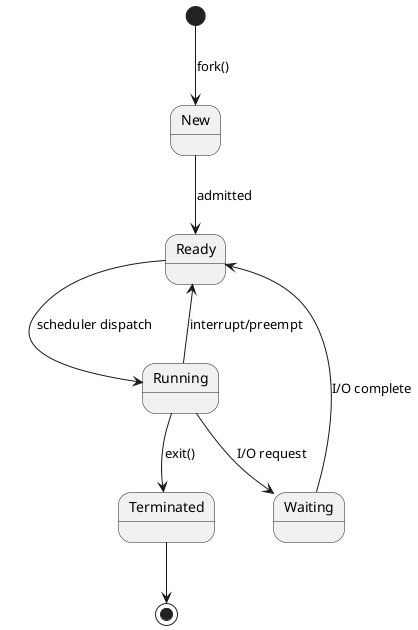
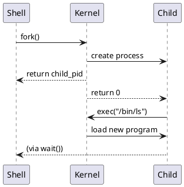
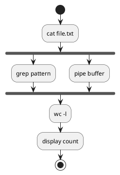

# Ghid: diagrame PlantUML în kit

PlantUML permite diagrame ca text (versionabil Git) → imagini PNG/SVG pentru slide-uri și fișe.

## 1. Locații în kit

- Diagrame per săptămână: `SO_cursXX/diagrame/*.puml`
- Stiluri comune: `diagrame_common/skin.puml`

## 2. Generare rapidă

```bash
# Cu scriptul din kit (descarcă JAR automat)
python3 generate_diagrams.py --output ./_rendered

# Direct cu JAR local
java -jar plantuml.jar -tpng diagrame/*.puml
```

## 3. Sintaxă de bază (exemple OS)

### 3.1 Diagrama de stări (procese)



### 3.2 Diagrama de secvență (fork/exec)



### 3.3 Diagrama de activitate (pipeline)



## 4. Quick Reference

| Element | Sintaxă | Utilizare OS |
|---------|---------|--------------|
| Stare | `State1 --> State2` | Stări procese |
| Notă | `note right: text` | Explicații |
| Fork | `fork` / `end fork` | Procese paralele |
| If | `if (cond) then` | Decizii în flowchart |
| Grup | `box "Kernel"` | Separare user/kernel |
| Culoare | `#LightBlue` | Evidențiere |

## 5. Includerea skin-ului comun

La începutul fiecărui `.puml`:
```plantuml
@startuml
!include ../diagrame_common/skin.puml
' ... restul diagramei
@enduml
```

## 6. Recomandări

- **Curs**: diagrame de ansamblu (arhitectură, stări)
- **Laborator**: diagrame de flux (pași, decizii)
- Sursa (`.puml`) în Git, imaginile ca derivat (regenerabile)

## 7. Debugging diagrame

Erori comune:
- `!include` cu cale greșită → verifică path relativ
- Lipsă `@startuml`/`@enduml` → obligatorii
- Caractere speciale în etichete → folosește `"text cu spații"`

Testare rapidă online: https://www.plantuml.com/plantuml/uml/

Data ediției: **27 ianuarie 2026**
