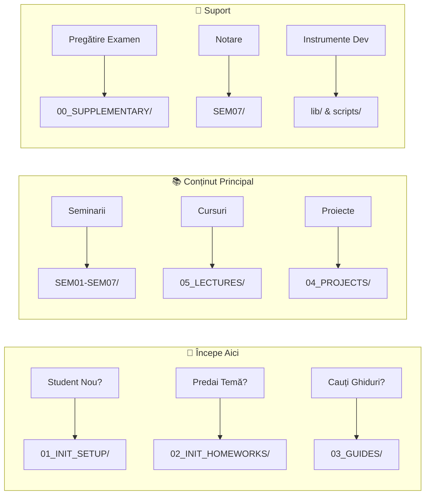

# ROso — Sisteme de Operare: Kit Educațional Complet

<div align="center">

```
┌──────────────────────────────────────────────────────────────────────────────────────────────┐
│  🐧 LINUX    Ubuntu 24.04+    │  📋 BASH 5.0+   │  🐍 PYTHON 3.12+  │  📦 GIT 2.40+        │
├──────────────────────────────────────────────────────────────────────────────────────────────┤
│  LICENȚĂ          RESTRICTIVĂ │  UNITĂȚI              14+4  │  ORE ESTIMATE          60+       │
│  VERSIUNE             5.3.1   │  SEMINARII               7  │  PROIECTE             23       │
│  STARE                ACTIVĂ  │  HTML INTERACTIVE      71  │  SCRIPTURI            180+       │
│  LIMBĂ                ROMÂNĂ  │  DIAGRAME PNG          27  │  ACOPERIRE TESTE       >80%      │
└──────────────────────────────────────────────────────────────────────────────────────────────┘
```

[](https://github.com/antonioclim/ROso)
[](https://github.com/antonioclim/ENos)
[](#licență)
[](https://ubuntu.com/)

**de ing. dr. Antonio Clim** | Academia de Studii Economice din București — CSIE  
Anul I, Semestrul 2 | 2017–2030

</div>

---

## 📋 Cuprins

<details open>
<summary><strong>Clic pentru expandare/restrângere</strong></summary>

- [Noutăți în v5.3](#-noutăți-în-v53)
- [Navigare Rapidă](#-navigare-rapidă)
- [Prezentare Generală Kit](#-prezentare-generală-kit)
- [Structura Depozitului](#-structura-depozitului)
- [Partea I: Configurare și Instalare](#partea-i-configurare-și-instalare)
- [Partea II: Seminarii (SEM01–SEM07)](#partea-ii-seminarii-sem01sem07)
- [Partea III: Cursuri (14 de bază + 4 suplimentare)](#partea-iii-cursuri-14-de-bază--4-suplimentare)
- [Partea IV: Proiecte](#partea-iv-proiecte)
- [Partea V: Utilități Partajate și Instrumente pentru Dezvoltatori](#partea-v-utilități-partajate-și-instrumente-pentru-dezvoltatori)
- [Partea VI: Infrastructură Anti-Plagiat](#partea-vi-infrastructură-anti-plagiat)
- [Partea VII: Pipeline CI/CD](#partea-vii-pipeline-cicd)
- [Partea VIII: Pedagogie și Filosofia Cursului](#partea-viii-pedagogie-și-filosofia-cursului)
- [Anexe](#anexe)
- [Licență](#licență)

</details>

---

## 🆕 Noutăți în v5.3

| Funcționalitate | Descriere | Stare |
|:-------:|-------------|:------:|
| 🖨️ | **Foi de stil pentru imprimare** pentru prezentări HTML (materiale offline) | ✅ NOU |
| 🔗 | **Verificare linkuri** în pipeline CI (validare automată) | ✅ NOU |
| 🧪 | **Suită de teste extinsă** pentru utilități partajate (>80% acoperire) | ✅ NOU |
| 📚 | **Documentație lib/** cu exemple complete de utilizare | ✅ NOU |
| 🤖 | **Scanner amprentă AI** pentru detectarea lucrărilor generate de AI | ✅ Îmbunătățit |
| 📊 | **Utilități de randomizare** pentru parametri de testare specifici fiecărui student | ✅ Îmbunătățit |

---

## 🚀 Navigare Rapidă



| Vreau să... | Mergi la | Descriere |
|:-------------|:------|:------------|
| 🔧 Configurez mediul | [`01_INIT_SETUP/`](./01_INIT_SETUP/) | Ghiduri instalare WSL2/VirtualBox |
| 📝 Predau tema | [`02_INIT_HOMEWORKS/`](./02_INIT_HOMEWORKS/) | Scripturi înregistrare, instrumente predare |
| 📖 Găsesc ghiduri student | [`03_GUIDES/`](./03_GUIDES/) | FAQ, contribuții, manual student |
| 💼 Explorez proiecte | [`04_PROJECTS/`](./04_PROJECTS/) | 23 proiecte (Ușor/Mediu/Avansat) |
| 📚 Citesc notițe curs | [`05_LECTURES/`](./05_LECTURES/) | 14 unități de bază + 4 suplimentare |
| 🎓 Mă pregătesc pentru examen | [`00_SUPPLEMENTARY/`](./00_SUPPLEMENTARY/) | Exerciții, referință rapidă, diagrame |
| 📊 Înțeleg notarea | [`SEM07/`](./SEM07/) | Grile, calculator note, politici |
| 🛠️ Folosesc utilități partajate | [`lib/`](./lib/) | Logging, randomizare, testare |

---

## 📊 Prezentare Generală Kit

### Vedere de Ansamblu

```
┌─────────────────────────────────────────────────────────────────────────────┐
│                        KIT EDUCAȚIONAL ROso v5.3.1                          │
├─────────────────────────────────────────────────────────────────────────────┤
│                                                                             │
│  ┌─────────────┐   ┌─────────────┐   ┌─────────────┐   ┌─────────────┐      │
│  │   14 + 4    │   │      7      │   │     23      │   │    180+     │      │
│  │   CURSURI   │   │  SEMINARII  │   │  PROIECTE   │   │  SCRIPTURI  │      │
│  │ (Bază+Supl) │   │  (Complete) │   │ (3 Niveluri)│   │(Bash+Python)│      │
│  └─────────────┘   └─────────────┘   └─────────────┘   └─────────────┘      │
│                                                                             │
│  ┌─────────────┐   ┌─────────────┐   ┌─────────────┐   ┌─────────────┐      │
│  │     71      │   │     27      │   │     26      │   │     28      │      │
│  │    HTML     │   │     PNG     │   │     SVG     │   │    YAML     │      │
│  │(Interactive)│   │ (Diagrame)  │   │ (Grafică)   │   │(Chestionare)│      │
│  └─────────────┘   └─────────────┘   └─────────────┘   └─────────────┘      │
│                                                                             │
└─────────────────────────────────────────────────────────────────────────────┘
```

### Statistici Complete

| Categorie | Cantitate | Locație | Detalii |
|:---------|:--------:|:---------|:--------|
| **Cursuri Teoretice** | 14 | `05_LECTURES/01-14` | Concepte SO de bază |
| **Cursuri Suplimentare** | 4 | `05_LECTURES/15-18supp` | Rețea, Containere, Kernel, NPU |
| **Seminarii Practice** | 7 | `SEM01-SEM07/` | Inclusiv săptămâna de evaluare |
| **Proiecte de Semestru** | 23 | `04_PROJECTS/` | 5 Ușoare + 15 Medii + 3 Avansate |
| **Documentație Markdown** | 362 | În tot kit-ul | Ghiduri, materiale, referințe |
| **Prezentări HTML** | 71 | Diverse foldere `/docs/` | Simulatoare interactive |
| **Diagrame PNG** | 27 | `00_SUPPLEMENTARY/diagrams_png/` | Vizualizări concepte |
| **Diagrame SVG** | 26 | `SEM*/docs/images/` | Grafică vectorială |
| **Scripturi Python** | 65 | `*/scripts/python/` | Autogradere, generatoare, instrumente |
| **Scripturi Bash** | 118 | `*/scripts/bash/`, `*/scripts/demo/` | Demo-uri, utilități, validatoare |
| **Fișiere Quiz YAML** | 28 | `*/formative/` | Bănci de întrebări |
| **Fișiere de Test** | 25+ | `*/tests/` | Teste pytest și shell |
| **Ore Estimate** | 60+ | — | Pentru acoperire completă |

---

## 📁 Structura Depozitului

### Arhitectură de Nivel Superior

```
ROso/
├── 📄 README.md                    # Acest ghid complet
├── 📄 README_ADDITIONS.md          # Modificări și adăugiri recente
├── 📄 NAVIGATION.md                # Index navigare rapidă
├── 📄 LICENCE.md                   # Termeni detaliaṭi licență
├── 📄 LICENSE                      # Referință licență scurtă
├── 📄 pyproject.toml               # Configurare proiect Python
│
├── 📂 00_SUPPLEMENTARY/            # Pregătire examen, diagrame, referințe
├── 📂 01_INIT_SETUP/               # Ghiduri instalare (WSL2, VirtualBox)
├── 📂 02_INIT_HOMEWORKS/           # Infrastructură predare teme
├── 📂 03_GUIDES/                   # Ghiduri student, FAQ, contribuții
├── 📂 04_PROJECTS/                 # 23 proiecte de semestru
├── 📂 05_LECTURES/                 # 14+4 unități de curs
│
├── 📂 SEM01/                       # Fundamentele Shell
├── 📂 SEM02/                       # Redirecționare I/O și Bucle
├── 📂 SEM03/                       # Find, Xargs, Permisiuni
├── 📂 SEM04/                       # Procesare Text (grep/sed/awk)
├── 📂 SEM05/                       # Funcții și Tablouri
├── 📂 SEM06/                       # Proiect de Sinteză
├── 📂 SEM07/                       # Evaluare și Notare
│
├── 📂 lib/                         # Utilități Python partajate
├── 📂 scripts/                     # Scripturi automatizare globale
└── 📂 assets/                      # CSS, imagini, resurse
```

---

## Partea I: Configurare și Instalare

### Pasul 0: Alege Opțiunea de Instalare

| Opțiune | Pentru cine | Avantaje | Dezavantaje |
|:-------|:---------|:-----------|:--------------|
| **WSL2** ⭐ | Windows 10/11 | Rapid, integrat, fără restart | Necesită Windows actualizat |
| **VirtualBox** | Orice SO | Izolare completă, snapshot-uri | Mai lent, mai multe resurse |
| **Dual boot** | Utilizatori avansați | Performanță nativă | Risc, trebuie restart |

### Pasul 1: Instalarea WSL2 (Recomandat)

```powershell
# POWERSHELL (Administrator)
# 1. Activează funcționalitățile necesare
dism.exe /online /enable-feature /featurename:Microsoft-Windows-Subsystem-Linux /all /norestart
dism.exe /online /enable-feature /featurename:VirtualMachinePlatform /all /norestart

# 2. REPORNEȘTE CALCULATORUL

# 3. După restart, instalează Ubuntu
wsl --update
wsl --set-default-version 2
wsl --install -d Ubuntu-24.04
```

### Pasul 2: Configurarea Ubuntu

```bash
# BASH (Ubuntu)
# Actualizează sistemul
sudo apt update && sudo apt upgrade -y

# Instalează pachetele necesare
sudo apt install -y git vim nano tree htop ncdu shellcheck \
    python3 python3-pip python3-venv build-essential \
    openssh-server curl wget figlet lolcat cowsay fortune pv dialog jq bc

# Verifică instalarea
./01_INIT_SETUP/verify_installation.sh
```

### Credențiale Standard Laborator

| Sistem | Utilizator | Parolă |
|:-------|:---------|:---------|
| Ubuntu/WSL | `stud` | `stud` |
| Portainer | `stud` | `studstudstud` |
| URL | — | `http://localhost:9000` |

---

## Partea II: Seminarii (SEM01–SEM07)

### Tabel Prezentare Seminarii

| Săpt | Seminar | Temă | Competențe Cheie | Ore |
|:----:|:--------|:------|:-----------|:-----:|
| 1 | **SEM01** | Fundamentele Shell | Navigare, variabile, FHS, quoting, globbing | 3+3 |
| 2 | **SEM02** | Redirecționare I/O și Bucle | Pipes, filtre, `for`/`while`, baze scripting | 3+3 |
| 3 | **SEM03** | Find, Xargs, Permisiuni | `find -exec`, `xargs`, `chmod`, `getopts`, cron | 3+3 |
| 4 | **SEM04** | Procesare Text | Expresii regulate, `grep`, `sed`, `awk` | 3+3 |
| 5 | **SEM05** | Funcții și Tablouri | Scripting robust, `trap`, logging, debugging | 3+3 |
| 6 | **SEM06** | Proiect de Sinteză | Integrare Monitor, Backup, Deployer | 6+6 |
| 7 | **SEM07** | Evaluare | Evaluare, susținere orală, notare | 3 |

---

## Partea III: Cursuri (14 de bază + 4 suplimentare)

### Unități de Curs Detaliate

| # | Temă | HTML Interactiv | Concepte Cheie |
|:-:|:------|:-----------------|:-------------|
| 01 | Introducere în SO | Simulator Mod Dual, Arhitecturi Kernel | Istoric, structură, moduri |
| 02 | Concepte de Bază SO | Flux Întreruperi, Polling vs Întreruperi | Apeluri sistem, întreruperi |
| 03 | Procese (PCB+fork) | Diagramă Stări Proces, Simulator Fork | PCB, fork, exec, wait |
| 04 | Planificare Procese | Gantt Planificare, Simulator MLFQ | FCFS, SJF, RR, MLFQ |
| 05 | Fire de Execuție | Memorie Thread vs Proces | Fire utilizator/kernel |
| 06 | Sincronizare I | Condiție de Cursă, Algoritm Peterson | Secțiune critică, lacăte |
| 07 | Sincronizare II | Operații Semafor, Producător-Consumator | Semafoare, monitoare |
| 08 | Interblocare | Vizualizator RAG, Algoritm Banker | Condiții Coffman |
| 09 | Gestiune Memorie I | Vizualizator Paginare, Segmentare | Paginare, segmentare |
| 10 | Memorie Virtuală | Înlocuire Pagini, Set de Lucru | TLB, anomalia Bélády |
| 11 | Sistem Fișiere I | Explorator Inode, Hard vs Simbolic | Inode-uri, linkuri |
| 12 | Sistem Fișiere II | Metode Alocare, Demo Jurnalizare | Alocare, jurnalizare |
| 13 | Securitate | Calculator Permisiuni, Buffer Overflow | AAA, capabilități |
| 14 | Virtualizare | VM vs Container | Tip 1/2, containere |

---

## Partea IV: Proiecte

### Categorii Proiecte

| Nivel | Icon | Proiecte | Ore Est. | Cerințe |
|:------|:----:|:--------:|:----------:|:-------------|
| **UȘOR** | 🟢 | E01–E05 | 15-20h | Doar Bash |
| **MEDIU** | 🟡 | M01–M15 | 25-35h | Bash + K8s opțional |
| **AVANSAT** | 🔴 | A01–A03 | 40-50h | Bash + integrare C |

### Criterii Evaluare

| Componentă | Pondere |
|:----------|:------:|
| Funcționalitate corectă | 40% |
| Calitate cod | 20% |
| Documentație | 15% |
| Teste automate | 15% |
| Prezentare | 10% |

---

## Partea V: Utilități Partajate și Instrumente pentru Dezvoltatori

### lib/ — Module Python Partajate

- `logging_utils.py` — Logging consistent și colorat
- `randomisation_utils.py` — Parametri anti-plagiat specifici studenților

### scripts/ — Scripturi Automatizare

- `check_links.sh` — Validator linkuri documentație
- `add_print_styles.sh` — Injectare CSS imprimare în HTML

---

## Partea VI: Infrastructură Anti-Plagiat

### Sistem Detectare Multi-Strat

| Instrument | Comandă | Scop |
|:-----|:--------|:--------|
| Detector Intern | `make plagiarism-check` | Similaritate rapidă + paternuri AI |
| MOSS | `make moss-check` | Comparație structurală Stanford |
| JPlag | `make jplag-check` | Analiză detaliată offline |
| Verificare Orală | Manual | Confirmare înțelegere |

---

## Anexe

### Anexa A: Credențiale Standard Laborator

| Sistem | Utilizator | Parolă |
|:-------|:---------|:---------|
| Ubuntu/WSL | `stud` | `stud` |
| Portainer | `stud` | `studstudstud` |
| URL Portainer | — | `http://localhost:9000` |

### Anexa B: Comenzi de Urgență

```bash
# Informații sistem
lsb_release -a
uname -a

# Stare resurse
df -h          # Spațiu disc
free -h        # Memorie
top -bn1 | head -20  # Procese

# Loguri
journalctl -xe --no-pager | tail -50

# Restart WSL (din PowerShell)
wsl --shutdown
wsl
```

---

## Licență

### Sumar

| Permisiune | Stare |
|:-----------|:------:|
| ✅ Studiu personal | Permis |
| ✅ Execuție cod pentru învățare | Permis |
| ✅ Modificare locală pentru experimentare | Permis |
| ✅ Citare academică cu atribuire | Permis |
| ❌ Redistribuire | **Interzis** |
| ❌ Lucrări derivate pentru uz public | **Interzis** |
| ❌ Uz comercial | **Interzis** |

### Atribuire

Pentru citarea acestor materiale în lucrări academice:

```
Clim, A. (2026). ROso — Kit Educațional pentru Sisteme de Operare (v5.3.1).
Academia de Studii Economice din București — CSIE.
https://github.com/antonioclim/ROso
```

### BibTeX

```bibtex
@misc{clim2026roso,
  author       = {Clim, Antonio},
  title        = {{ROso}: Sisteme de Operare — Kit Educațional Complet},
  year         = {2026},
  version      = {5.3.1},
  institution  = {Academia de Studii Economice din București},
  howpublished = {\url{https://github.com/antonioclim/ROso}},
  note         = {Versiune în limba română. Versiune engleză: ENos}
}
```

Vezi [LICENCE.md](./LICENCE.md) pentru termenii completi.

---

<div align="center">

**Kit actualizat:** Ianuarie 2026  
**Versiune:** 5.3.1  
**Testat pe:** Ubuntu 24.04 LTS, WSL2 cu Ubuntu 22.04/24.04  
**Feedback:** [GitHub Issues](https://github.com/antonioclim/ROso/issues)

---

**ing. dr. Antonio Clim**  
Asistent Universitar (perioadă determinată)  
Academia de Studii Economice din București — CSIE

🇷🇴 [ROso (Română)](https://github.com/antonioclim/ROso) | 🇬🇧 [ENos (Engleză)](https://github.com/antonioclim/ENos)

</div>
