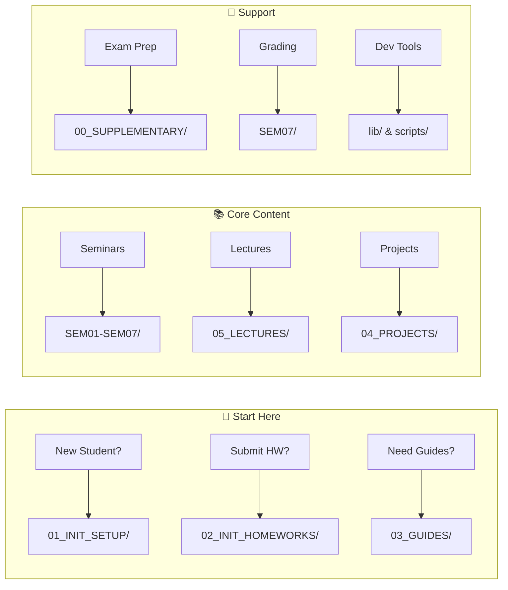
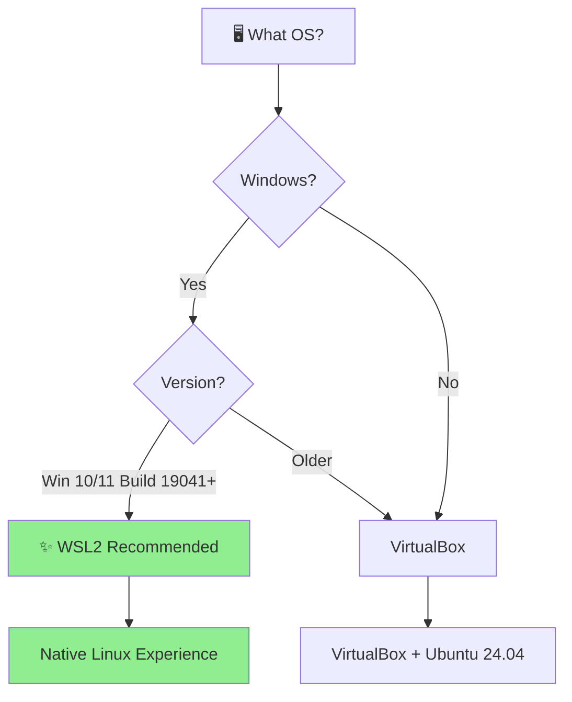
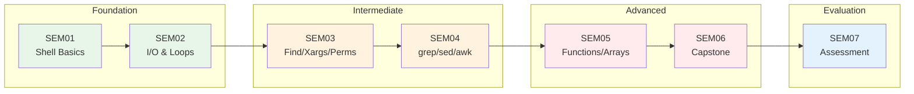
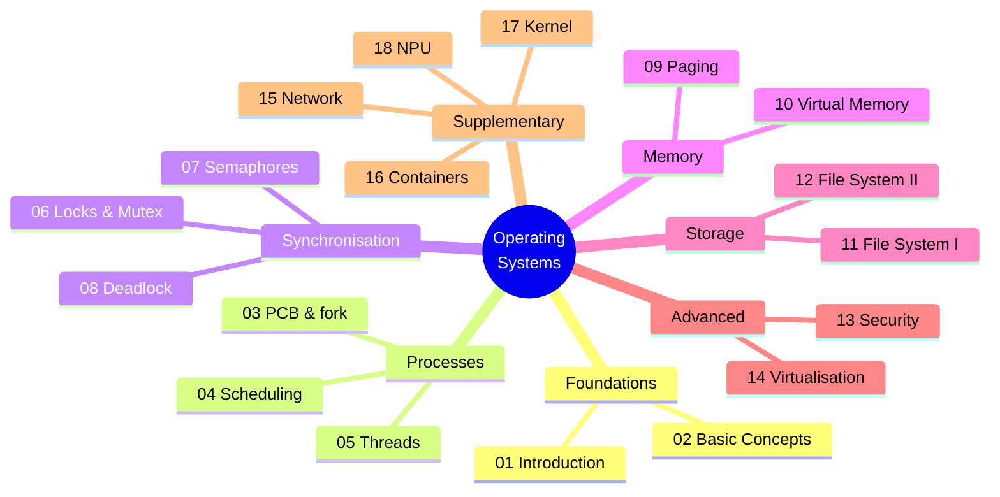
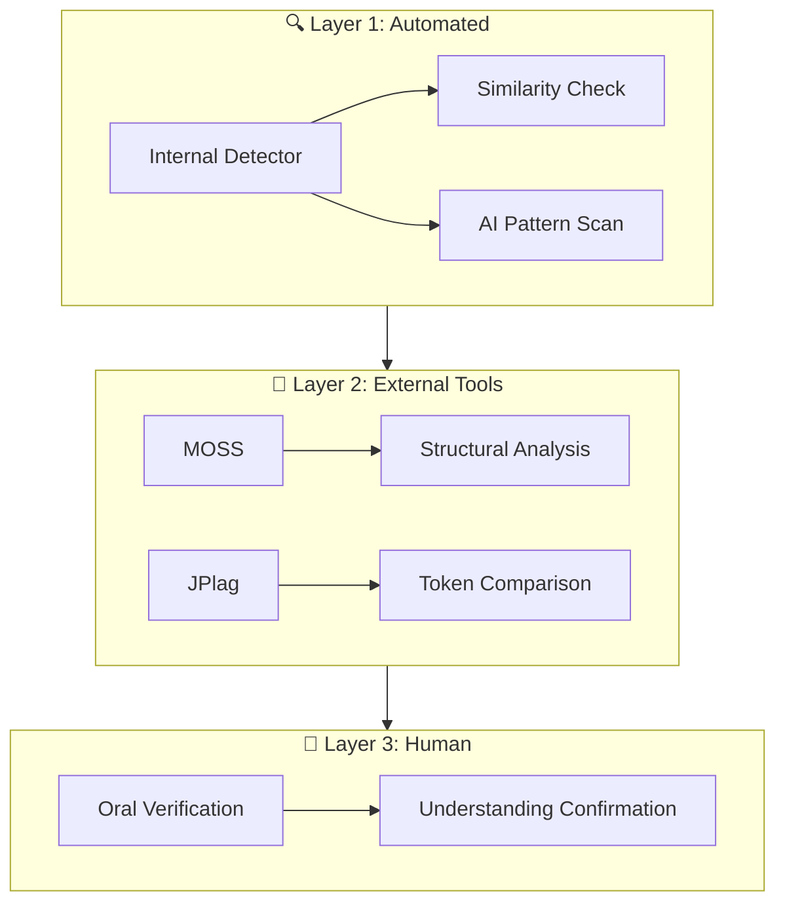
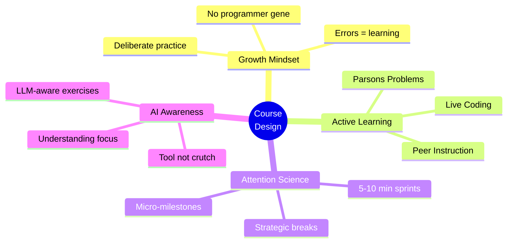

# ENos — Operating Systems: Complete Educational Kit

<div align="center">

```
┌──────────────────────────────────────────────────────────────────────────────────────────────┐
│  🐧 LINUX    Ubuntu 24.04+    │  📋 BASH 5.0+   │  🐍 PYTHON 3.12+  │  📦 GIT 2.40+         │
├──────────────────────────────────────────────────────────────────────────────────────────────┤
│  LICENCE           RESTRICTIVE │  UNITS               14+4  │  EST. HOURS          60+      │
│  VERSION               5.3.1   │  SEMINARS               7  │  PROJECTS             23      │
│  STATUS               ACTIVE   │  HTML INTERACTIVE      71  │  SCRIPTS            180+      │
│  LANGUAGE            ENGLISH   │  PNG DIAGRAMS          27  │  TEST COVERAGE       >80%     │
└──────────────────────────────────────────────────────────────────────────────────────────────┘
```

[](https://github.com/antonioclim/ENos)
[](https://github.com/antonioclim/ROso)
[](#licence)
[](https://ubuntu.com/)

**by ing. dr. Antonio Clim** | Bucharest University of Economic Studies — CSIE  
Year I, Semester 2 | 2017–2030

</div>

---

## 📋 Table of Contents

<details open>
<summary><strong>Click to expand/collapse</strong></summary>

- [What's New in v5.3](#-whats-new-in-v53)
- [Quick Navigation](#-quick-navigation)
- [Kit Overview](#-kit-overview)
- [Repository Structure](#-repository-structure)
- [Part I: Setup and Configuration](#part-i-setup-and-configuration)
- [Part II: Seminars (SEM01–SEM07)](#part-ii-seminars-sem01sem07)
- [Part III: Lectures (14 Core + 4 Supplementary)](#part-iii-lectures-14-core--4-supplementary)
- [Part IV: Projects](#part-iv-projects)
- [Part V: Shared Utilities & Developer Tools](#part-v-shared-utilities--developer-tools)
- [Part VI: Anti-Plagiarism Infrastructure](#part-vi-anti-plagiarism-infrastructure)
- [Part VII: CI/CD Pipeline](#part-vii-cicd-pipeline)
- [Part VIII: Pedagogy & Course Philosophy](#part-viii-pedagogy--course-philosophy)
- [Annexes](#annexes)
- [Licence](#licence)

</details>

---

## 🆕 What's New in v5.3

| Feature | Description | Status |
|:-------:|-------------|:------:|
| 🖨️ | **Print stylesheets** for HTML presentations (offline handouts) | ✅ NEW |
| 🔗 | **Link checking** in CI pipeline (automated validation) | ✅ NEW |
| 🧪 | **Expanded test suite** for shared utilities (>80% coverage) | ✅ NEW |
| 📚 | **lib/ documentation** with comprehensive usage examples | ✅ NEW |
| 🤖 | **AI fingerprint scanner** for detecting AI-generated submissions | ✅ Enhanced |
| 📊 | **Randomisation utilities** for student-specific test parameters | ✅ Enhanced |

---

## 🚀 Quick Navigation



| I want to... | Go to | Description |
|:-------------|:------|:------------|
| 🔧 Set up my environment | [`01_INIT_SETUP/`](./01_INIT_SETUP/) | WSL2/VirtualBox installation guides |
| 📝 Submit homework | [`02_INIT_HOMEWORKS/`](./02_INIT_HOMEWORKS/) | Recording scripts, submission tools |
| 📖 Find student guides | [`03_GUIDES/`](./03_GUIDES/) | FAQ, contributing, student handbook |
| 💼 Browse projects | [`04_PROJECTS/`](./04_PROJECTS/) | 23 projects (Easy/Medium/Advanced) |
| 📚 Read lecture notes | [`05_LECTURES/`](./05_LECTURES/) | 14 core + 4 supplementary units |
| 🎓 Prepare for exam | [`00_SUPPLEMENTARY/`](./00_SUPPLEMENTARY/) | Exercises, quick reference, diagrams |
| 📊 Understand grading | [`SEM07/`](./SEM07/) | Rubrics, grade calculator, policies |
| 🛠️ Use shared utilities | [`lib/`](./lib/) | Logging, randomisation, testing |

---

## 📊 Kit Overview

### At a Glance

```
┌─────────────────────────────────────────────────────────────────────────────┐
│                        ENos EDUCATIONAL KIT v5.3.1                          │
├─────────────────────────────────────────────────────────────────────────────┤
│                                                                             │
│  ┌─────────────┐   ┌─────────────┐   ┌─────────────┐   ┌─────────────┐     │
│  │   14 + 4    │   │      7      │   │     23      │   │    180+     │     │
│  │  LECTURES   │   │  SEMINARS   │   │  PROJECTS   │   │   SCRIPTS   │     │
│  │ (Core+Supp) │   │ (Complete)  │   │ (3 Levels)  │   │(Bash+Python)│     │
│  └─────────────┘   └─────────────┘   └─────────────┘   └─────────────┘     │
│                                                                             │
│  ┌─────────────┐   ┌─────────────┐   ┌─────────────┐   ┌─────────────┐     │
│  │     71      │   │     27      │   │     26      │   │     28      │     │
│  │    HTML     │   │     PNG     │   │     SVG     │   │    YAML     │     │
│  │(Interactive)│   │ (Diagrams)  │   │ (Graphics)  │   │  (Quizzes)  │     │
│  └─────────────┘   └─────────────┘   └─────────────┘   └─────────────┘     │
│                                                                             │
└─────────────────────────────────────────────────────────────────────────────┘
```

### Comprehensive Statistics

| Category | Quantity | Location | Details |
|:---------|:--------:|:---------|:--------|
| **Theoretical Lectures** | 14 | `05_LECTURES/01-14` | Core OS concepts |
| **Supplementary Lectures** | 4 | `05_LECTURES/15-18supp` | Network, Containers, Kernel, NPU |
| **Practical Seminars** | 7 | `SEM01-SEM07/` | Including evaluation week |
| **Semester Projects** | 23 | `04_PROJECTS/` | 5 Easy + 15 Medium + 3 Advanced |
| **Markdown Documentation** | 362 | Throughout | Guides, materials, references |
| **HTML Presentations** | 71 | Various `/docs/` folders | Interactive simulators |
| **PNG Diagrams** | 27 | `00_SUPPLEMENTARY/diagrams_png/` | Concept visualisations |
| **SVG Diagrams** | 26 | `SEM*/docs/images/` | Vector graphics |
| **Python Scripts** | 65 | `*/scripts/python/` | Autograders, generators, tools |
| **Bash Scripts** | 118 | `*/scripts/bash/`, `*/scripts/demo/` | Demos, utilities, validators |
| **YAML Quiz Files** | 28 | `*/formative/` | Question banks |
| **Test Files** | 25+ | `*/tests/` | pytest and shell tests |
| **Estimated Hours** | 60+ | — | For complete coverage |

---

## 📁 Repository Structure

### Top-Level Architecture

```
ENos/
├── 📄 README.md                    # This comprehensive guide
├── 📄 README_ADDITIONS.md          # Recent changes and additions
├── 📄 NAVIGATION.md                # Quick navigation index
├── 📄 LICENCE.md                   # Detailed licence terms
├── 📄 LICENSE                      # Short licence reference
├── 📄 pyproject.toml               # Python project configuration
│
├── 📂 00_SUPPLEMENTARY/            # Exam prep, diagrams, references
├── 📂 01_INIT_SETUP/               # Installation guides (WSL2, VirtualBox)
├── 📂 02_INIT_HOMEWORKS/           # Homework submission infrastructure
├── 📂 03_GUIDES/                   # Student guides, FAQ, contributing
├── 📂 04_PROJECTS/                 # 23 semester projects
├── 📂 05_LECTURES/                 # 14+4 lecture units
│
├── 📂 SEM01/                       # Shell Fundamentals
├── 📂 SEM02/                       # I/O Redirection & Loops
├── 📂 SEM03/                       # Find, Xargs, Permissions
├── 📂 SEM04/                       # Text Processing (grep/sed/awk)
├── 📂 SEM05/                       # Functions & Arrays
├── 📂 SEM06/                       # Capstone Project
├── 📂 SEM07/                       # Evaluation & Grading
│
├── 📂 lib/                         # Shared Python utilities
├── 📂 scripts/                     # Global automation scripts
└── 📂 assets/                      # CSS, images, resources
```

### Detailed Folder Breakdown

<details>
<summary><strong>📂 00_SUPPLEMENTARY/ — Exam Preparation Materials</strong></summary>

```
00_SUPPLEMENTARY/
├── 📄 README.md                    # Folder overview
├── 📄 QUICK_REFERENCE_CARD.md      # Command cheat sheet
├── 📄 REFERENCES.md                # Bibliography and links
├── 📄 Exam_Exercises_Part1.md      # Practice problems (99KB)
├── 📄 Exam_Exercises_Part2.md      # Practice problems (83KB)
├── 📄 Exam_Exercises_Part3.md      # Practice problems (90KB)
├── 📂 diagrams_common/
│   └── skin.puml                   # PlantUML theme
├── 📂 diagrams_png/                # 27 concept diagrams
│   ├── coffman_conditions.png
│   ├── critical_section.png
│   ├── dining_philosophers.png
│   ├── docker_namespaces.png
│   ├── fork_copy_on_write.png
│   ├── hard_vs_symbolic_link.png
│   ├── inode_structure.png
│   ├── journaling_mechanism.png
│   ├── kernel_architectures.png
│   ├── mlfq_structure.png
│   ├── multithreading_models.png
│   ├── os_evolution.png
│   ├── page_replacement_algorithms.png
│   ├── paging_mechanism.png
│   ├── process_state_diagram.png
│   ├── producer_consumer.png
│   ├── race_condition.png
│   ├── scheduling_gantt_comparison.png
│   ├── security_aaa_permissions.png
│   ├── syscall_categories.png
│   ├── syscall_mechanism.png
│   ├── system_layers.png
│   ├── thread_vs_process_memory.png
│   ├── tlb_memory_access.png
│   ├── virtual_address_space.png
│   └── vm_vs_container.png
├── 📄 generate_diagrams.py         # PlantUML → PNG converter
└── 📄 validate.sh                  # Validation script
```

**Purpose:** Comprehensive exam preparation with 270+ pages of exercises covering all course topics.

</details>

<details>
<summary><strong>📂 01_INIT_SETUP/ — Installation Guides</strong></summary>

```
01_INIT_SETUP/
├── 📄 README.md                    # Setup overview
├── 📄 QUICK_START_EN.md            # 5-minute quick start
├── 📄 GUIDE_WSL2_Ubuntu2404_EN.md  # WSL2 detailed guide
├── 📄 GUIDE_WSL2_Ubuntu2404_INTERACTIVE.html
├── 📄 GUIDE_VirtualBox_Ubuntu2404_EN.md
├── 📄 GUIDE_VirtualBox_Ubuntu2404_INTERACTIVE.html
├── 📂 images/
│   └── SCREENSHOTS_NEEDED.md       # Placeholder for screenshots
└── 📄 verify_installation.sh       # Environment verification script
```

**Purpose:** Step-by-step setup guides for WSL2 (recommended) and VirtualBox with interactive HTML versions.

</details>

<details>
<summary><strong>📂 02_INIT_HOMEWORKS/ & 03_GUIDES/ — Student Resources</strong></summary>

```
02_INIT_HOMEWORKS/                  03_GUIDES/
├── 📄 README_EN.md                 ├── 📄 README_EN.md
├── 📄 CHANGELOG_EN.md              ├── 📄 CHANGELOG_EN.md
├── 📄 CONTRIBUTING_EN.md           ├── 📄 CONTRIBUTING_EN.md
├── 📄 FAQ_EN.md                    ├── 📄 FAQ_EN.md
├── 📄 STUDENT_GUIDE_EN.md          ├── 📄 STUDENT_GUIDE_EN.md
├── 📄 STUDENT_GUIDE_EN.html        ├── 📄 STUDENT_GUIDE_EN.html
├── 📄 record_homework_EN.sh        ├── 📄 record_homework_EN.sh
└── 📄 record_homework_tui_EN.py    ├── 📄 record_homework_tui_EN.py
                                    ├── 📄 check_my_submission.sh
                                    └── 📂 examples/
                                        └── sample_submission_demo.cast
```

**Purpose:** 
- `02_INIT_HOMEWORKS/`: Homework recording and submission infrastructure
- `03_GUIDES/`: Comprehensive student handbook, FAQ, contribution guidelines

</details>

<details>
<summary><strong>📂 04_PROJECTS/ — Semester Projects (23 Total)</strong></summary>

```
04_PROJECTS/
├── 📄 README.md                    # Project overview
├── 📄 PROJECT_SELECTION_GUIDE.md   # How to choose
├── 📄 GENERAL_EVALUATION.md        # Evaluation criteria
├── 📄 TECHNICAL_GUIDE.md           # Best practices
├── 📄 UNIVERSAL_RUBRIC.md          # Grading rubric
├── 📄 KUBERNETES_INTRO.md          # K8s optional extension
├── 📄 Makefile                     # Build automation
│
├── 📂 b)EASY/                      # ⭐⭐ Beginner (5 projects)
│   ├── E01_File_System_Auditor.md
│   ├── E02_Log_Analyzer.md
│   ├── E03_Bulk_File_Organizer.md
│   ├── E04_System_Health_Reporter.md
│   └── E05_Config_File_Manager.md
│
├── 📂 a)MEDIUM/                    # ⭐⭐⭐ Intermediate (15 projects)
│   ├── M01_Incremental_Backup_System.md
│   ├── M02_Process_Lifecycle_Monitor.md
│   ├── M03_Service_Health_Watchdog.md
│   ├── M04_Network_Security_Scanner.md
│   ├── M05_Deployment_Pipeline.md
│   ├── M06_Resource_Usage_Historian.md
│   ├── M07_Security_Audit_Framework.md
│   ├── M08_Disk_Storage_Manager.md
│   ├── M09_Scheduled_Tasks_Manager.md
│   ├── M10_Process_Tree_Analyzer.md
│   ├── M11_Memory_Forensics_Tool.md
│   ├── M12_File_Integrity_Monitor.md
│   ├── M13_Log_Aggregator.md
│   ├── M14_Environment_Config_Manager.md
│   └── M15_Parallel_Execution_Engine.md
│
├── 📂 c)ADVANCED/                  # ⭐⭐⭐⭐⭐ Expert (3 projects)
│   ├── A01_Mini_Job_Scheduler.md
│   ├── A02_Interactive_Shell_Extension.md
│   └── A03_Distributed_File_Sync.md
│
├── 📂 AUTOMATED_EVALUATION_SPEC/   # Test specifications
│   ├── AUTOMATED_EVALUATION_SPEC.md
│   ├── AUTOMATED_EVALUATION_SUMMARY.md
│   ├── TEST_SPEC_EASY.md
│   ├── TEST_SPEC_MEDIUM.md
│   └── TEST_SPEC_ADVANCED.md
│
├── 📂 helpers/                     # Utility scripts
│   ├── project_validator.sh
│   ├── submission_packager.sh
│   └── test_runner.sh
│
├── 📂 templates/                   # Project templates
│   ├── project_structure.sh
│   ├── README_template.md
│   └── Makefile_template
│
└── 📂 formative/
    └── project_readiness_quiz.yaml
```

**Project Difficulty Matrix:**

| Level | Projects | Est. Time | Requirements |
|:------|:--------:|:---------:|:-------------|
| 🟢 **EASY** | 5 | 15-20h | Bash only |
| 🟡 **MEDIUM** | 15 | 25-35h | Bash + optional K8s |
| 🔴 **ADVANCED** | 3 | 40-50h | Bash + C integration |

</details>

<details>
<summary><strong>📂 05_LECTURES/ — 14 Core + 4 Supplementary Units</strong></summary>

```
05_LECTURES/
├── 📂 00-HTML_all_as_ZIP(again)/
│   └── also_you_can_find_each_in_lectures_docs.zip
│
├── 📂 01-Introduction_to_Operating_Systems/
│   ├── README.md
│   ├── 📂 docs/
│   │   ├── 01ex1_-_Dual_Mode_Simulator.html
│   │   ├── 01ex2_-_Kernel_Architectures.html
│   │   ├── C01_01_COURSE_PLAN.md
│   │   ├── C01_02_CONCEPT_MAP.md
│   │   ├── C01_03_DISCUSSION_QUESTIONS.md
│   │   ├── C01_04_STUDY_GUIDE.md
│   │   └── C01_05_FORMATIVE_ASSESSMENT.yaml
│   └── 📂 scripts/
│       └── batch_sim.py
│
├── 📂 02-Basic_OS_Concepts/
├── 📂 03-Processes_(PCB+fork)/
├── 📂 04-Process_Scheduling/
├── 📂 05-Execution_Threads/
├── 📂 06-Synchronisation_(Part1_Peterson+locks+mutex)/
├── 📂 07-Synchronisation_(Part2_semaphore_buffer)/
├── 📂 08-Deadlock_(Coffman)/
├── 📂 09-Memory_Management_Part1_paging_segmentation/
├── 📂 10-Virtual_Memory_(TLB_Belady)/
├── 📂 11-File_System_(Part1_inode_pointers)/
├── 📂 12-File_System_Part2_alloc_extent_struct/
├── 📂 13-Security_in_Operating_Systems/
├── 📂 14-Virtualization+Recap/
│
├── 📂 15supp-Network_Connection/           # Supplementary
├── 📂 16supp-Advanced_Containerisation/    # Supplementary
├── 📂 17supp-Kernel_Level_OS_Programming/  # Supplementary
└── 📂 18supp-NPU_Integration_in_Operating_Systems/ # Supplementary
```

**Each lecture unit contains:**

| File Pattern | Purpose |
|:-------------|:--------|
| `README.md` | Unit overview |
| `C##_01_COURSE_PLAN.md` | Learning objectives, timing |
| `C##_02_CONCEPT_MAP.md` | Visual topic relationships |
| `C##_03_DISCUSSION_QUESTIONS.md` | Peer instruction questions |
| `C##_04_STUDY_GUIDE.md` | Self-study material |
| `C##_05_FORMATIVE_ASSESSMENT.yaml` | Quiz questions |
| `##ex#_-_*.html` | Interactive HTML simulators |
| `diagrams/*.puml` | PlantUML source files |
| `scripts/*.py`, `scripts/*.sh` | Demo scripts |

</details>

<details>
<summary><strong>📂 SEM01-SEM06/ — Seminar Packages (Standard Structure)</strong></summary>

```
SEM0X/
├── 📄 README.md                    # Seminar overview
├── 📄 CHANGELOG.md                 # Version history
├── 📄 Makefile                     # Build/test automation
├── 📄 requirements.txt             # Python dependencies
│
├── 📂 ci/                          # CI/CD configuration
│   ├── github_actions.yml          # GitHub Actions workflow
│   └── linting.toml                # Linting configuration
│
├── 📂 docs/                        # Pedagogical materials
│   ├── S0X_00_PEDAGOGICAL_ANALYSIS_PLAN.md
│   ├── S0X_01_INSTRUCTOR_GUIDE.md
│   ├── S0X_02_MAIN_MATERIAL.md
│   ├── S0X_03_PEER_INSTRUCTION.md
│   ├── S0X_04_PARSONS_PROBLEMS.md
│   ├── S0X_05_LIVE_CODING_GUIDE.md
│   ├── S0X_06_SPRINT_EXERCISES.md
│   ├── S0X_07_LLM_AWARE_EXERCISES.md
│   ├── S0X_08_SPECTACULAR_DEMOS.md
│   ├── S0X_09_VISUAL_CHEAT_SHEET.md
│   ├── S0X_10_SELF_ASSESSMENT_REFLECTION.md
│   ├── lo_traceability.md
│   └── 📂 images/                  # SVG diagrams
│
├── 📂 formative/                   # Quiz system
│   ├── quiz.yaml                   # Question bank
│   ├── quiz_lms.json               # LMS export format
│   └── quiz_runner.py              # Interactive quiz runner
│
├── 📂 homework/                    # Assignments
│   ├── S0X_01_HOMEWORK.md          # Assignment specification
│   ├── S0X_03_EVALUATION_RUBRIC.md
│   ├── S0X_04_ORAL_VERIFICATION*.md
│   ├── 📂 OLD_HW/                  # Archive of previous assignments
│   └── 📂 solutions/               # Reference solutions (instructor)
│
├── 📂 presentations/               # Interactive slides
│   ├── S0X_01_presentation.html
│   └── S0X_02_cheat_sheet.html
│
├── 📂 resources/
│   └── S0X_RESOURCES.md            # Additional reading
│
├── 📂 scripts/
│   ├── 📂 bash/                    # Utility scripts
│   │   ├── S0X_01_setup_seminar.sh
│   │   ├── S0X_02_interactive_quiz.sh
│   │   └── S0X_03_validator.sh
│   ├── 📂 demo/                    # Live coding demos
│   │   └── S0X_0X_demo_*.sh
│   └── 📂 python/                  # Automation tools
│       ├── S0X_01_autograder.py
│       ├── S0X_02_quiz_generator.py
│       └── S0X_03_report_generator.py
│
└── 📂 tests/                       # Test suite
    ├── README.md
    ├── run_all_tests.sh
    └── test_*.py
```

</details>

<details>
<summary><strong>📂 SEM07/ — Evaluation and Grading</strong></summary>

```
SEM07/
├── 📄 README.md
├── 📂 docs/
│   ├── S07_00_PEDAGOGICAL_ANALYSIS_PLAN.md
│   └── S07_01_INSTRUCTOR_GUIDE.md
│
├── 📂 external_tools/              # Plagiarism detection
│   ├── MOSS_JPLAG_GUIDE.md
│   ├── run_moss.sh
│   └── run_plagiarism_check.sh
│
├── 📂 final_test/
│   └── 📂 test_bank/
│       └── questions_pool.yaml
│
├── 📂 grade_aggregation/
│   ├── GRADING_POLICY.md
│   ├── final_grade_calculator_EN.py
│   └── 📂 templates/
│       ├── homework_grades_template.csv
│       ├── project_grades_template.csv
│       └── test_grades_template.csv
│
├── 📂 homework_evaluation/
│   ├── HOMEWORK_EVALUATION_GUIDE.md
│   ├── grade_homework_EN.py
│   ├── verify_homework_EN.sh
│   └── 📂 homework_rubrics/
│       ├── S01_HOMEWORK_RUBRIC.md
│       ├── S02_HOMEWORK_RUBRIC.md
│       ├── S03_HOMEWORK_RUBRIC.md
│       ├── S04_HOMEWORK_RUBRIC.md
│       ├── S05_HOMEWORK_RUBRIC.md
│       └── S06_HOMEWORK_RUBRIC.md
│
└── 📂 project_evaluation/
    ├── 📂 Docker/
    │   └── Dockerfile
    ├── manual_eval_checklist_EN.md
    ├── oral_defence_questions_EN.md
    └── run_auto_eval_EN.sh
```

**Purpose:** Complete evaluation infrastructure including automated grading, plagiarism detection, oral defence protocols, and grade calculation.

</details>

<details>
<summary><strong>📂 lib/ — Shared Python Utilities (NEW in v5.3)</strong></summary>

```
lib/
├── 📄 README.md                    # Comprehensive documentation
├── 📄 __init__.py                  # Package initialisation
├── 📄 logging_utils.py             # Coloured logging
├── 📄 randomisation_utils.py       # Anti-plagiarism parameters
├── 📄 test_logging_utils.py        # Unit tests
└── 📄 test_randomisation_utils.py  # Unit tests
```

**Purpose:** Centralised utility modules ensuring consistency across all seminar packages.

</details>

<details>
<summary><strong>📂 scripts/ — Global Automation (NEW in v5.3)</strong></summary>

```
scripts/
├── 📄 add_print_styles.sh          # Inject print CSS into HTML
├── 📄 check_links.sh               # Documentation link validator
└── 📄 verify_links.sh              # Alternative link checker
```

**Purpose:** Kit-wide automation for quality assurance.

</details>

---

## Part I: Setup and Configuration

### Step 0: Choose Your Installation Option



| Option | For whom | Advantages | Disadvantages |
|:-------|:---------|:-----------|:--------------|
| **WSL2** ⭐ | Windows 10/11 | Fast, integrated, no reboot | Requires updated Windows |
| **VirtualBox** | Any OS | Complete isolation, snapshots | Slower, more resources |
| **Dual boot** | Advanced users | Native performance | Risk, must reboot |

### Step 1: Installing WSL2 (Recommended)

```powershell
# POWERSHELL (Administrator)
# 1. Enable required features
dism.exe /online /enable-feature /featurename:Microsoft-Windows-Subsystem-Linux /all /norestart
dism.exe /online /enable-feature /featurename:VirtualMachinePlatform /all /norestart

# 2. RESTART YOUR COMPUTER

# 3. After restart, install Ubuntu
wsl --update
wsl --set-default-version 2
wsl --install -d Ubuntu-24.04
```

### Step 2: Configure Ubuntu

```bash
# BASH (Ubuntu)
# Update system
sudo apt update && sudo apt upgrade -y

# Install required packages
sudo apt install -y git vim nano tree htop ncdu shellcheck \
    python3 python3-pip python3-venv build-essential \
    openssh-server curl wget figlet lolcat cowsay fortune pv dialog jq bc

# Verify installation
./01_INIT_SETUP/verify_installation.sh
```

### Standard Lab Credentials

| System | Username | Password |
|:-------|:---------|:---------|
| Ubuntu/WSL | `stud` | `stud` |
| Portainer | `stud` | `studstudstud` |
| URL | — | `http://localhost:9000` |

---

## Part II: Seminars (SEM01–SEM07)

### Seminar Progression Map



### Seminar Overview Table

| Week | Seminar | Topic | Key Skills | Hours |
|:----:|:--------|:------|:-----------|:-----:|
| 1 | **SEM01** | Shell Fundamentals | Navigation, variables, FHS, quoting, globbing | 3+3 |
| 2 | **SEM02** | I/O Redirection & Loops | Pipes, filters, `for`/`while`, scripting basics | 3+3 |
| 3 | **SEM03** | Find, Xargs, Permissions | `find -exec`, `xargs`, `chmod`, `getopts`, cron | 3+3 |
| 4 | **SEM04** | Text Processing | Regular expressions, `grep`, `sed`, `awk` | 3+3 |
| 5 | **SEM05** | Functions & Arrays | Robust scripting, `trap`, logging, debugging | 3+3 |
| 6 | **SEM06** | Capstone Project | Monitor, Backup, Deployer integration | 6+6 |
| 7 | **SEM07** | Evaluation | Assessment, oral defence, grading | 3 |

### Seminar Document Types

#### For Instructors

| Document | Purpose |
|:---------|:--------|
| `S0X_00_PEDAGOGICAL_ANALYSIS_PLAN.md` | Learning design and objectives |
| `S0X_01_INSTRUCTOR_GUIDE.md` | Session facilitation guide |
| `S0X_05_LIVE_CODING_GUIDE.md` | Demo scripts and walkthroughs |
| `S0X_08_SPECTACULAR_DEMOS.md` | Engaging demonstrations |

#### For Students

| Document | Purpose |
|:---------|:--------|
| `S0X_02_MAIN_MATERIAL.md` | Core content and explanations |
| `S0X_03_PEER_INSTRUCTION.md` | Discussion questions |
| `S0X_04_PARSONS_PROBLEMS.md` | Code ordering exercises |
| `S0X_06_SPRINT_EXERCISES.md` | Timed practice problems |
| `S0X_07_LLM_AWARE_EXERCISES.md` | AI-resistant tasks |
| `S0X_09_VISUAL_CHEAT_SHEET.md` | Quick reference |
| `S0X_10_SELF_ASSESSMENT_REFLECTION.md` | Self-evaluation |

### Typical Seminar Flow (100 minutes)

```
┌────────────────────────────────────────────────────────────────────────────────┐
│                         SEMINAR STRUCTURE (100 min)                            │
├────────────────────────────────────────────────────────────────────────────────┤
│                                                                                │
│  0min        5min       20min       35min       45min   50min                 │
│    │          │          │           │           │       │                    │
│    ▼          ▼          ▼           ▼           ▼       ▼                    │
│  ┌────┐    ┌─────┐    ┌─────┐    ┌─────┐    ┌────┐   ┌─────┐                 │
│  │HOOK│───▶│ PI  │───▶│LIVE │───▶│SPRINT│───▶│ PI │──▶│BREAK│                │
│  │DEMO│    │ Q1  │    │CODE │    │  1   │    │ Q2 │   │☕    │                │
│  └────┘    └─────┘    └─────┘    └─────┘    └────┘   └─────┘                 │
│                                                                                │
│  60min       75min       85min       95min      100min                        │
│    │          │           │           │           │                           │
│    ▼          ▼           ▼           ▼           ▼                           │
│  ┌─────┐   ┌─────┐    ┌─────┐    ┌─────┐    ┌─────┐                          │
│  │LIVE │──▶│ PI  │───▶│SPRINT│───▶│WRAP │───▶│ HW  │                          │
│  │CODE │   │ Q3  │    │  2   │    │ UP  │    │INTRO│                          │
│  └─────┘   └─────┘    └─────┘    └─────┘    └─────┘                          │
│                                                                                │
│  Legend: PI = Peer Instruction, HW = Homework                                  │
└────────────────────────────────────────────────────────────────────────────────┘
```

---

## Part III: Lectures (14 Core + 4 Supplementary)

### Course Topic Map



### Lecture Units Detailed

| # | Topic | Interactive HTML | Key Concepts |
|:-:|:------|:-----------------|:-------------|
| 01 | Introduction to OS | Dual Mode Simulator, Kernel Architectures | History, structure, modes |
| 02 | Basic OS Concepts | Interrupt Flow, Polling vs Interrupts | System calls, interrupts |
| 03 | Processes (PCB+fork) | Process State Diagram, Fork Simulator, Zombie/Orphan | PCB, fork, exec, wait |
| 04 | Process Scheduling | Scheduling Gantt, MLFQ Simulator, Starvation Demo | FCFS, SJF, RR, MLFQ |
| 05 | Execution Threads | Thread vs Process Memory, Threading Models | User/kernel threads |
| 06 | Synchronisation I | Race Condition, Peterson Algorithm, Mutex vs Spinlock | Critical section, locks |
| 07 | Synchronisation II | Semaphore Operations, Producer-Consumer, Readers-Writers | Semaphores, monitors |
| 08 | Deadlock | RAG Visualizer, Banker's Algorithm, Detection/Recovery | Coffman conditions |
| 09 | Memory Management I | Memory Partitioning, Paging Visualizer, Segmentation | Paging, segmentation |
| 10 | Virtual Memory | Page Replacement, Working Set, Thrashing Demo | TLB, Bélády's anomaly |
| 11 | File System I | Inode Explorer, Pointer Indirection, Hard vs Symbolic | Inodes, links |
| 12 | File System II | Allocation Methods, Journaling Demo | Allocation, journaling |
| 13 | Security | Permissions Calculator, Buffer Overflow Demo | AAA, capabilities |
| 14 | Virtualisation | VM vs Container | Type 1/2, containers |
| 15 | Network (supp) | Socket API Flow, TCP vs UDP, I/O Multiplexing | Sockets, protocols |
| 16 | Containers (supp) | Namespaces, Cgroups, Overlay FS | Docker internals |
| 17 | Kernel (supp) | Module Lifecycle, Character Device | Kernel modules, eBPF |
| 18 | NPU (supp) | Heterogeneous Computing, CPU/GPU/NPU | AI accelerators |

---

## Part IV: Projects

### Project Selection Flowchart

```
                          START HERE
                              │
                              ▼
              ┌───────────────────────────────┐
              │ Have you written >500 lines   │
              │ of Bash code before?          │
              └───────────────────────────────┘
                        │
                 ┌──────┴──────┐
                 │             │
                YES            NO
                 │             │
                 ▼             ▼
          ┌──────────┐   ┌──────────────────────┐
          │ Do you   │   │ 👉 START WITH EASY   │
          │ know C?  │   │    E01-E05           │
          └──────────┘   │    (15-20 hours)     │
                 │       └──────────────────────┘
          ┌──────┴──────┐
          │             │
         YES            NO
          │             │
          ▼             ▼
   ┌──────────────┐  ┌──────────────────────┐
   │ 👉 ADVANCED  │  │ 👉 MEDIUM            │
   │    A01-A03   │  │    M01-M15           │
   │  (40-50 hrs) │  │    (25-35 hours)     │
   └──────────────┘  └──────────────────────┘
```

### Project Categories

| Level | Icon | Projects | Est. Hours | Requirements |
|:------|:----:|:--------:|:----------:|:-------------|
| **EASY** | 🟢 | E01–E05 | 15-20h | Bash only |
| **MEDIUM** | 🟡 | M01–M15 | 25-35h | Bash + optional K8s |
| **ADVANCED** | 🔴 | A01–A03 | 40-50h | Bash + C integration |

### All Projects List

<details>
<summary><strong>🟢 EASY Projects (5)</strong></summary>

| ID | Name | Description |
|:---|:-----|:------------|
| E01 | File System Auditor | Scan directories, report statistics |
| E02 | Log Analyzer | Parse and summarise log files |
| E03 | Bulk File Organizer | Sort files by type/date/size |
| E04 | System Health Reporter | Generate system status reports |
| E05 | Config File Manager | Backup and manage configurations |

</details>

<details>
<summary><strong>🟡 MEDIUM Projects (15)</strong></summary>

| ID | Name | Description |
|:---|:-----|:------------|
| M01 | Incremental Backup System | rsync-based backup with rotation |
| M02 | Process Lifecycle Monitor | Track process birth/death events |
| M03 | Service Health Watchdog | Monitor and restart services |
| M04 | Network Security Scanner | Port scanning and vulnerability check |
| M05 | Deployment Pipeline | Automated deployment workflow |
| M06 | Resource Usage Historian | Historical resource tracking |
| M07 | Security Audit Framework | System security assessment |
| M08 | Disk Storage Manager | Disk usage monitoring and cleanup |
| M09 | Scheduled Tasks Manager | Enhanced cron job management |
| M10 | Process Tree Analyzer | Visualise process hierarchies |
| M11 | Memory Forensics Tool | Memory usage analysis |
| M12 | File Integrity Monitor | Detect file modifications |
| M13 | Log Aggregator | Centralise logs from multiple sources |
| M14 | Environment Config Manager | Manage environment variables |
| M15 | Parallel Execution Engine | Parallel task execution |

</details>

<details>
<summary><strong>🔴 ADVANCED Projects (3)</strong></summary>

| ID | Name | Description |
|:---|:-----|:------------|
| A01 | Mini Job Scheduler | Custom job scheduling system |
| A02 | Interactive Shell Extension | Extended shell features |
| A03 | Distributed File Sync | Multi-node file synchronisation |

</details>

### Project Timeline

```
Week 8         Week 10        Week 12        Week 14        Exam Session
  │              │              │              │                 │
  ▼              ▼              ▼              ▼                 ▼
┌────────┐    ┌────────┐    ┌────────┐    ┌────────┐      ┌────────┐
│ SELECT │───▶│   M1   │───▶│   M2   │───▶│ SUBMIT │─────▶│PRESENT │
│PROJECT │    │ CHECK  │    │ CHECK  │    │ FINAL  │      │& DEMO  │
└────────┘    └────────┘    └────────┘    └────────┘      └────────┘
     │              │              │              │
     └── 2 weeks ───┴── 2 weeks ──┴── 2 weeks ──┘
```

### Evaluation Criteria

| Component | Weight |
|:----------|:------:|
| Correct functionality | 40% |
| Code quality | 20% |
| Documentation | 15% |
| Automated tests | 15% |
| Presentation | 10% |

---

## Part V: Shared Utilities & Developer Tools

### lib/ — Shared Python Modules

#### logging_utils.py

Provides consistent, coloured logging across all Python scripts.

```python
from logging_utils import setup_logging

logger = setup_logging(__name__)
logger.info("Processing started")
logger.warning("Low disk space")
logger.error("File not found")
```

**Colour Scheme:**

| Level | Colour | ANSI Code |
|:------|:-------|:----------|
| DEBUG | Cyan | `\033[0;36m` |
| INFO | Green | `\033[0;32m` |
| WARNING | Yellow | `\033[0;33m` |
| ERROR | Red | `\033[0;31m` |
| CRITICAL | Bold Red | `\033[1;31m` |

#### randomisation_utils.py

Generates deterministic, student-specific test parameters for anti-plagiarism.

```python
from randomisation_utils import generate_student_seed, randomise_test_parameters

seed = generate_student_seed("student@ase.ro", "SEM03_HW")
params = randomise_test_parameters(seed)
# Same student + assignment = same parameters (reproducible)
```

**Generated Parameters:**

| Category | Fields |
|:---------|:-------|
| Network | `ip_addresses`, `ports` |
| File System | `file_sizes`, `file_names`, `directory_names` |
| Time | `timestamps`, `cron_hours`, `cron_days` |
| Process | `pids`, `signals` |
| Permissions | `usernames`, `permissions_octal` |
| Text | `search_patterns`, `line_numbers` |

### scripts/ — Automation Scripts

#### check_links.sh

Validates documentation links across the entire kit.

```bash
# Check internal links only (fast)
./scripts/check_links.sh

# Check all links including external URLs (slow)
./scripts/check_links.sh --external

# Requirements: lychee (cargo install lychee)
```

#### add_print_styles.sh

Injects print stylesheets into HTML presentations for offline handouts.

```bash
# Preview changes
./scripts/add_print_styles.sh --dry-run

# Apply changes
./scripts/add_print_styles.sh
```

---

## Part VI: Anti-Plagiarism Infrastructure

### Multi-Layer Detection System



### Tools Overview

| Tool | Command | Purpose |
|:-----|:--------|:--------|
| Internal Detector | `make plagiarism-check` | Fast similarity + AI patterns |
| MOSS | `make moss-check` | Stanford structural comparison |
| JPlag | `make jplag-check` | Offline detailed analysis |
| Oral Verification | Manual | Understanding confirmation |

### AI Fingerprint Scanner

Located in `SEM01/scripts/python/S01_06_ai_fingerprint_scanner.py`:

```bash
python3 S01_06_ai_fingerprint_scanner.py submission.sh
```

**Detects patterns indicating AI generation:**
- Overly consistent comment style
- Unusual vocabulary patterns
- Suspicious formatting uniformity
- Common AI-generated phrases

---

## Part VII: CI/CD Pipeline

### GitHub Actions Workflow

Each seminar includes a CI configuration (`ci/github_actions.yml`) with:

| Job | Purpose | Tool |
|:----|:--------|:-----|
| `lint-bash` | Shell script linting | ShellCheck |
| `lint-python` | Python code linting | Ruff |
| `validate-yaml` | Quiz/config validation | yamllint |
| `ai-check` | AI fingerprint detection | Custom scanner |
| `link-check` | Documentation links | lychee |
| `test` | Unit tests with coverage | pytest |
| `structure-check` | Directory validation | Custom |

### Running Locally

```bash
cd SEM01
make test        # Run tests
make lint        # Run linters
make ai-check    # Check for AI patterns
make all         # Run everything
```

### Test Coverage Requirements

| Component | Target Coverage |
|:----------|:---------------:|
| lib/ | >80% |
| Autograders | >75% |
| Quiz generators | >70% |

---

## Part VIII: Pedagogy & Course Philosophy

### Core Principles



### Teaching Methods

| Method | Description | Research Basis |
|:-------|:------------|:---------------|
| **Peer Instruction** | Questions with pair discussions | Mazur (1997), Porter et al. (2016) |
| **Parsons Problems** | Code reordering exercises | Parsons & Haden (2006) |
| **Live Coding** | Real-time demonstration | Rubin (2013), Raj et al. (2018) |
| **Sprint Exercises** | Timed practice in short bursts | Cognitive load theory |
| **LLM-Aware Tasks** | Exercises requiring understanding | Contemporary necessity |

### What Students Will Be Able to Do

| Skill Area | Capabilities |
|:-----------|:-------------|
| **Automation** | Write scripts that automate complex tasks |
| **Debugging** | Use `strace`, `top`, `htop`, `lsof` effectively |
| **Administration** | Manage permissions, processes, services, cron |
| **Foundation** | Understand OS internals for any specialisation |

### Career Relevance

| Direction | Course Knowledge Applied |
|:----------|:-------------------------|
| DevOps / SRE | Scripting, processes, services, containers |
| Information Security | Permissions, processes, system audits |
| Backend Development | IPC, threading, virtual memory |
| Embedded / IoT | Processes, scheduling, kernel |
| Cloud Engineering | Virtualisation, containers, automation |
| Data Engineering | Text processing (grep/sed/awk), pipelines |

---

## Annexes

### Annex A: Standard Lab Credentials

| System | Username | Password |
|:-------|:---------|:---------|
| Ubuntu/WSL | `stud` | `stud` |
| Portainer | `stud` | `studstudstud` |
| Portainer URL | — | `http://localhost:9000` |

### Annex B: Emergency Commands

```bash
# System information
lsb_release -a
uname -a

# Resource status
df -h          # Disk space
free -h        # Memory
top -bn1 | head -20  # Processes

# Logs
journalctl -xe --no-pager | tail -50

# WSL restart (from PowerShell)
wsl --shutdown
wsl
```

### Annex C: Weekly Workflow

```
┌─────────────────────────────────────────────────────────────────────────────┐
│                         THE COURSE WEEK                                      │
├─────────────────────────────────────────────────────────────────────────────┤
│                                                                             │
│    ┌──────────────┐     ┌──────────────┐     ┌──────────────┐              │
│    │ BEFORE THE   │     │ DURING THE   │     │ AFTER THE    │              │
│    │   SEMINAR    │────▶│   SEMINAR    │────▶│   SEMINAR    │              │
│    └──────────────┘     └──────────────┘     └──────────────┘              │
│           │                    │                    │                       │
│           ▼                    ▼                    ▼                       │
│    ┌──────────────┐     ┌──────────────┐     ┌──────────────┐              │
│    │ 1. Read      │     │ 1. Participate│    │ 1. Review    │              │
│    │    README    │     │    actively  │     │    notes     │              │
│    │              │     │              │     │               │              │
│    │ 2. Go through│     │ 2. Note the  │     │ 2. Complete  │              │
│    │    MATERIAL  │     │    commands  │     │    homework  │              │
│    │              │     │              │     │               │              │
│    │ 3. Prepare   │     │ 3. Ask when  │     │ 3. Run       │              │
│    │    environment│    │    unclear   │     │    validator │              │
│    └──────────────┘     └──────────────┘     └──────────────┘              │
│                                                                             │
│    Time: 30 min         Time: 100 min        Time: 60-90 min               │
│                                                                             │
└─────────────────────────────────────────────────────────────────────────────┘
```

### Annex D: Complete .gitignore Template

```gitignore
# Temporary files
*.tmp
*.temp
*.bak
*.backup
*~
*.swp
*.swo

# Logs and output
*.log
*.out
*.err

# Python
__pycache__/
*.py[cod]
*.pyo
venv/
env/
.env

# Build artifacts
*.o
*.a
*.so
*.exe

# IDE
.idea/
.vscode/
*.sublime-*

# OS files
.DS_Store
Thumbs.db
Desktop.ini

# Archives
*.zip
*.tar.gz
*.rar
*.7z

# Generated
output/
results/
build/
dist/

# Sensitive
*.key
*.pem
passwords.txt
secrets.*
```

### Annex E: Kit Statistics Summary

| Category | Quantity | Details |
|:---------|:--------:|:--------|
| Theoretical Lectures | 14 | Chapters 01–14 |
| Supplementary Lectures | 4 | Chapters 15–18 |
| Practical Seminars | 7 | SEM01–SEM07 |
| Semester Projects | 23 | 5 EASY + 15 MEDIUM + 3 ADVANCED |
| Markdown Files | 362 | Documentation and guides |
| HTML Presentations | 71 | Interactive slides |
| PNG Diagrams | 27 | In `00_SUPPLEMENTARY/` |
| SVG Diagrams | 26 | Vector graphics |
| Python Scripts | 65 | Autograders, tools, tests |
| Bash Scripts | 118 | Demos, utilities, validators |
| YAML Quiz Files | 28 | Question banks |
| Test Files | 25+ | pytest and shell tests |
| Estimated Hours | 60+ | For complete coverage |

### Annex F: Changelog (Recent)

#### Version 5.3.1 (January 2026)

**New Features:**
- ✅ Added print stylesheets to all HTML presentations
- ✅ Added link checking to CI pipeline
- ✅ Expanded test coverage for lib/ utilities (>80%)
- ✅ Added lib/README.md documentation with usage examples

**Improvements:**
- Updated CI to version 2.2 with link-check job
- Standardised script documentation
- Enhanced test templates

**Files Added:**
- `lib/README.md`
- `lib/test_logging_utils.py`
- `lib/test_randomisation_utils.py`
- `scripts/check_links.sh`
- `scripts/add_print_styles.sh`
- `assets/css/print.css`
- `SEM01/tests/test_ai_fingerprint.py`

---

## Licence

### Summary

| Permission | Status |
|:-----------|:------:|
| ✅ Personal study | Allowed |
| ✅ Code execution for learning | Allowed |
| ✅ Local modification for experimentation | Allowed |
| ✅ Academic citation with attribution | Allowed |
| ❌ Redistribution | **Prohibited** |
| ❌ Derivative works for public use | **Prohibited** |
| ❌ Commercial use | **Prohibited** |

### Attribution

When citing these materials in academic works:

```
Clim, A. (2026). ENos — Educational Kit for Operating Systems (v5.3.1).
Bucharest University of Economic Studies — CSIE.
https://github.com/antonioclim/ENos
```

### BibTeX

```bibtex
@misc{clim2026enos,
  author       = {Clim, Antonio},
  title        = {{ENos}: Operating Systems — Complete Educational Kit},
  year         = {2026},
  version      = {5.3.1},
  institution  = {Bucharest University of Economic Studies},
  howpublished = {\url{https://github.com/antonioclim/ENos}},
  note         = {English language version. Romanian version: ROso}
}
```

See [LICENCE.md](./LICENCE.md) for complete terms.

---

<div align="center">

**Kit updated:** January 2026  
**Version:** 5.3.1  
**Tested on:** Ubuntu 24.04 LTS, WSL2 with Ubuntu 22.04/24.04  
**Feedback:** [GitHub Issues](https://github.com/antonioclim/ENos/issues)

---

**ing. dr. Antonio Clim**  
Assistant Lecturer (fixed-term)  
Bucharest University of Economic Studies — CSIE

🇬🇧 [ENos (English)](https://github.com/antonioclim/ENos) | 🇷🇴 [ROso (Romanian)](https://github.com/antonioclim/ROso)

</div>
